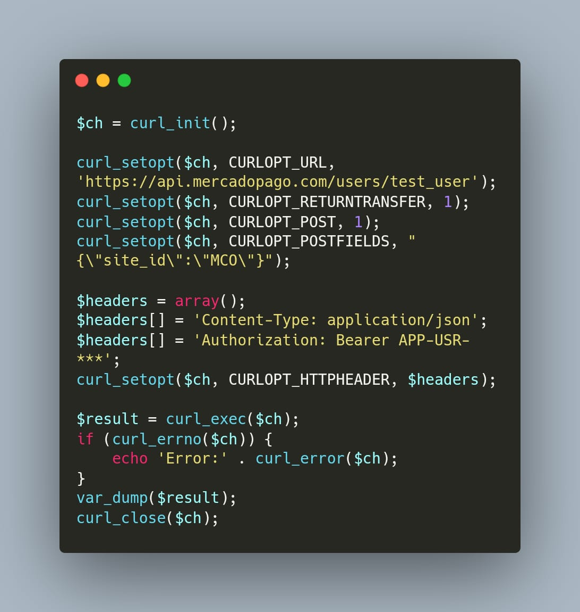
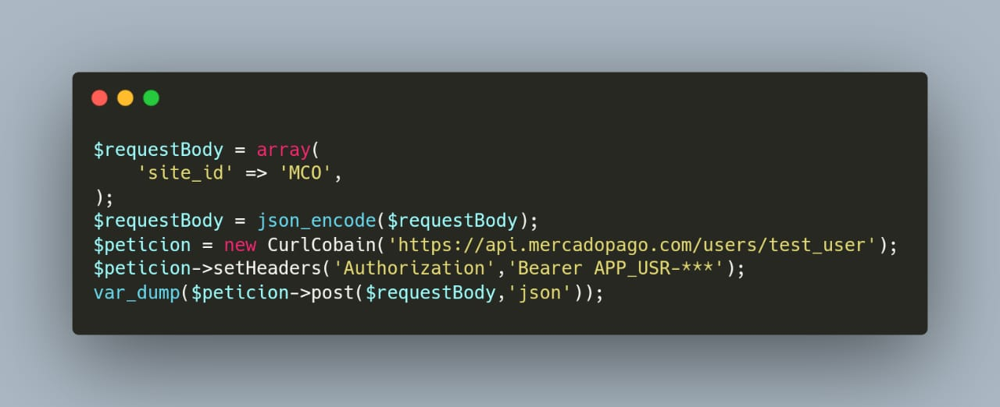

# CurlCobain
CurlCobain - Curl with PHP made easy, stop wasting time with long boring curl configuration

This Will make You life easy 

Imagine making that long curl request configuration in about 5 lines of code or less.

I'll show you and example.

# Post request to MercadoPago api for creating a new testing account.

```
$requestBody = array(
    'site_id' => 'MCO',
);
$requestBody = json_encode($requestBody);
$request = new CurlCobain('https://api.mercadopago.com/users/test_user');
$request->setHeaders('Authorization','Bearer APP_USR-****');
var_dump($request->post($requestBody,'json'));
```

That's all!

We change from this:



to this:


*See Docs* for more info, feel free to send pull request if You want to contribute to this proyect.
